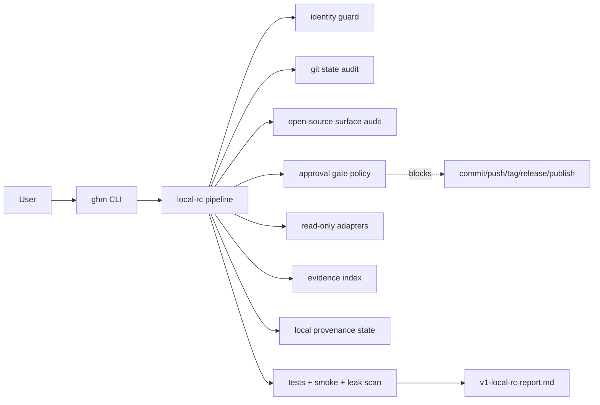

# graph-harness-maintain

**Status:** v1.0 local governance pipeline.

`graph-harness-maintain` provides a conservative, local-only governance and audit pipeline for agent-maintained repositories. It inspects repository identity, release surface, approval gates, evidence, provenance, tests, smoke checks, and leak scanning before any external publication step.

## Project purpose

The project exists to keep a maintenance harness observable, auditable, and approval-gated. v1.0 focuses on read-only inspection, local artifact generation, and proposal-only recommendations.

## v1.0 scope

v1.0 includes:

- identity guard
- git state inspection
- open-source release surface audit
- approval gate enforcement
- read-only maintenance adapters
- evidence indexing
- local provenance state generation
- tests and smoke checks
- leak scan and sensitive-term review
- local report generation

v1.0 does **not** execute destructive actions, remote publication, graph/events mutation, quarantine, rehydrate, provenance upgrade, or sensitive export.

## Architecture



## Install

```bash
python3 -m pip install -e ".[dev]"
```

## CLI usage

```bash
ghm --help
ghm identity-check
ghm audit-release
ghm locate-evidence
ghm check-gates
ghm provenance current-state
ghm pipeline local-rc
ghm pipeline local-rc --strict
ghm pipeline local-rc --ci
```

Module form also works:

```bash
python -m graph_harness_maintain --help
python -m graph_harness_maintain pipeline local-rc
```

Legacy read-only graph commands remain available:

```bash
graph-harness-maintain validate --schema tests/fixtures/synthetic_schema.yaml --graph tests/fixtures/synthetic_graph.jsonl --events tests/fixtures/synthetic_events.jsonl --evidence-candidates tests/fixtures/synthetic_evidence_candidate_index.jsonl --weak-associations tests/fixtures/synthetic_weak_association_sidecar_index.jsonl
```

## Pipeline command

Primary local release-candidate command:

```bash
ghm pipeline local-rc
```

## Approval gates

Allowed without human approval:

- read-only audit
- local tests
- local leak scan
- local report generation
- local evidence index generation
- local provenance state generation
- package import smoke test
- CLI smoke test
- local docs/policy/template edits

Always require human approval:

- `git_commit`
- `git_push`
- `git_tag`
- `github_release`
- `pypi_publish`
- `raw_archive_apply`
- `delete`
- `move`
- `graph_events_mutation`
- `quarantine`
- `rehydrate`
- `provenance_upgrade`
- `sensitive_export`

## Security model

- public-facing files must not contain tokens, credentials, local absolute paths, or private profile paths
- runtime reports stay local
- release readiness stops before publication actions
- adapter mutations are blocked behind approval requirements

## Limitations

- no destructive apply path in v1.0
- no remote publication execution
- no graph/event mutation
- no provenance upgrade
- no sensitive export

## Development checks

```bash
pytest
python -m graph_harness_maintain pipeline local-rc
```

## License

MIT. See [LICENSE](LICENSE).

## Contributing

See [CONTRIBUTING.md](CONTRIBUTING.md).
