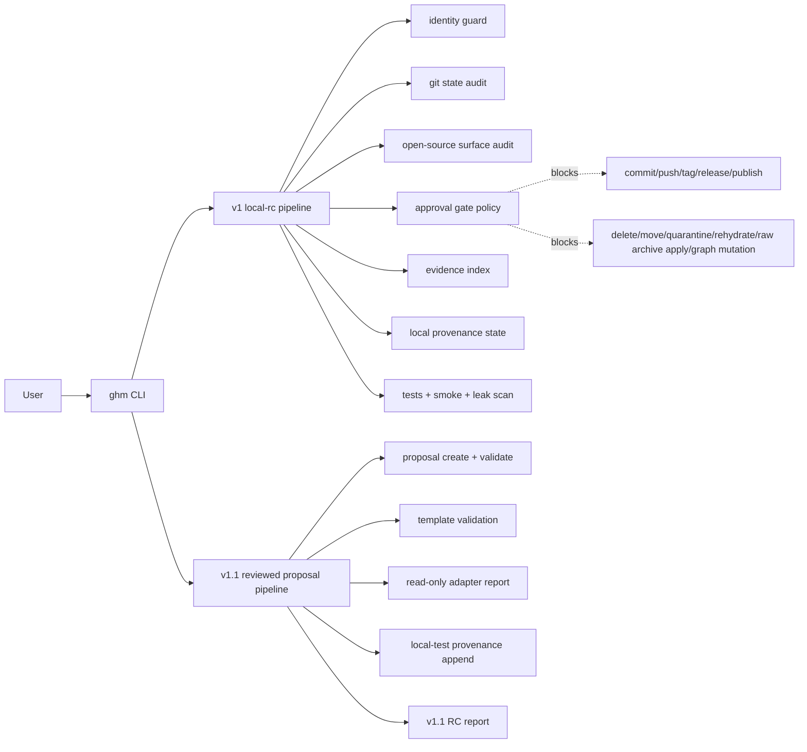

# graph-harness-maintain

**Status:** v2.0-dev reusable Agent Memory Graph reference implementation.

`graph-harness-maintain` provides a conservative, local-only governance and audit pipeline for agent-maintained repositories. It inspects repository identity, release surface, approval gates, evidence, provenance, tests, smoke checks, leak scanning, and v2 graph-governed context artifacts before any external publication step.

## Project purpose

The project keeps a maintenance harness observable, auditable, deterministic, and approval-gated. The implemented baseline has two local artifact tracks:

- **v1.0 local governance pipeline:** read-only inspection, local artifact generation, evidence indexing, and release-candidate reports.
- **v1.1 reviewed proposal layer:** proposal/template/adapter/provenance validation that remains proposal-only and does not execute reviewed actions.

## Install

For development or local release validation:

```bash
python -m pip install --upgrade pip
python -m pip install -e ".[dev]"
```

Optional packaging check:

```bash
python -m pip install build
python -m build
```

Do not commit `dist/`, `build/`, or generated `*.egg-info/` outputs.

## Quickstart

Use either the installed CLI or module form:

```bash
ghm --help
python -m graph_harness_maintain --help
```

Run the v1 local release-candidate pipeline:

```bash
python -m graph_harness_maintain pipeline local-rc --ci
python -m graph_harness_maintain pipeline local-rc --strict
```

Run the v1.1 reviewed-action local release-candidate pipeline:

```bash
python -m graph_harness_maintain pipeline v1.1-rc
python -m graph_harness_maintain pipeline v1.1-rc --strict
```

## v2.0 development: reusable global Agent Memory Graph protocol

v2.0 promotes `graph-harness-maintain` from a repo-local dashboard into the reference implementation and dashboard/export target for a reusable global Agent Memory Graph protocol. The default context order is graph-first: global graph, active profile, active project, project summary, decision ledger, requirements, constraints, lineage index, mapped logs/artifacts, and raw sessions last.

Use the portable `agent-graph` CLI to initialize repo manifests, bootstrap temporary memory roots, validate graph-governed context, archive agent-compiled session JSON, and export repo-local dashboard artifacts:

```bash
agent-graph init-repo --repo . --profile general --project harness-self-governance
TMP_MEM=$(mktemp -d)
agent-graph bootstrap --repo . --memory-root "$TMP_MEM"
agent-graph validate --repo . --memory-root "$TMP_MEM"
agent-graph export --repo . --memory-root "$TMP_MEM"
```

The repo manifest lives at `.agent/context.json`. Repo-local exports remain deterministic under `artifacts/v2/`. The dashboard is still static and read-only: no backend, no npm, no external CDN, no Hub-side LLM API, no destructive apply, no graph mutation execution, and no sensitive export.

Legacy v2 helper commands remain available:

```bash
python -m graph_harness_maintain proposal create
python -m graph_harness_maintain proposal validate
python -m graph_harness_maintain templates validate
python -m graph_harness_maintain adapter-report
python -m graph_harness_maintain provenance append --local-test
python -m graph_harness_maintain provenance current-state --ci
```

Legacy read-only graph commands remain available:

```bash
graph-harness-maintain validate \
  --schema tests/fixtures/synthetic_schema.yaml \
  --graph tests/fixtures/synthetic_graph.jsonl \
  --events tests/fixtures/synthetic_events.jsonl \
  --evidence-candidates tests/fixtures/synthetic_evidence_candidate_index.jsonl \
  --weak-associations tests/fixtures/synthetic_weak_association_sidecar_index.jsonl
```

## Artifact layout

Generated artifacts are local validation outputs and should not be committed.

- v1 artifacts: `artifacts/v1/`
- v1.1 artifacts: `artifacts/v1.1/`

Important v1.1 outputs include:

- `artifacts/v1.1/proposals/reviewed-apply-plan.json`
- `artifacts/v1.1/proposal-validation.json`
- `artifacts/v1.1/template-validation.json`
- `artifacts/v1.1/adapter-report.json`
- `artifacts/v1.1/adapter-report.md`
- `artifacts/v1.1/provenance/local-test-events.jsonl`
- `artifacts/v1.1/provenance/current-state.json`
- `artifacts/v1.1/v1.1-rc-report.md`

## Architecture



## Safety boundary

The release baseline is safe by default:

- proposal-only behavior by default
- reviewed apply is gated and not executed
- `destructive_operations_allowed` is false
- `remote_publication_allowed` is false
- raw archive apply is blocked/inert
- delete, move, quarantine, and rehydrate are blocked/inert
- graph mutation and graph/events mutation are blocked/inert
- sensitive export is blocked
- provenance append supports only `--local-test` artifact writes
- generated reports stay local unless deliberately promoted to documentation

Always require explicit human approval for:

- `git_commit`
- `git_push`
- `git_tag`
- `github_release`
- `pypi_publish`
- `raw_archive_apply`
- `delete`
- `move`
- `graph_mutation`
- `graph_events_mutation`
- `quarantine`
- `rehydrate`
- `provenance_upgrade`
- `sensitive_export`
- `reviewed_apply`
- `apply_plan_execute`
- `force_push`

## Development checks

```bash
python -m pytest
python -m graph_harness_maintain pipeline local-rc --ci
python -m graph_harness_maintain pipeline local-rc --strict
python -m graph_harness_maintain pipeline v1.1-rc
python -m graph_harness_maintain pipeline v1.1-rc --strict
```

Before any local commit, verify the configured identity is the approved user-owned identity for the repository:

```bash
git config --local user.name
git config --local user.email
git var GIT_AUTHOR_IDENT
git var GIT_COMMITTER_IDENT
```

## Security model

- public-facing files must not contain tokens, credentials, local absolute paths, or private profile paths
- runtime reports stay under ignored artifact paths
- release readiness stops before publication actions
- adapter mutations are documented as approval-required; adapter reports do not execute side effects

## License

MIT. See [LICENSE](LICENSE).

## Contributing

See [CONTRIBUTING.md](CONTRIBUTING.md).

## v2.0 dual-graph architecture

- `artifacts/v2/graph/governance-graph.json`: repo-wide Governance Graph for dashboard exploration and evidence navigation
- `artifacts/v2/graph/agent-memory-graph.json`: Agent Memory Graph for graph-governed context loading
- Dashboard Graph page defaults to Governance mode and can switch to Memory mode
